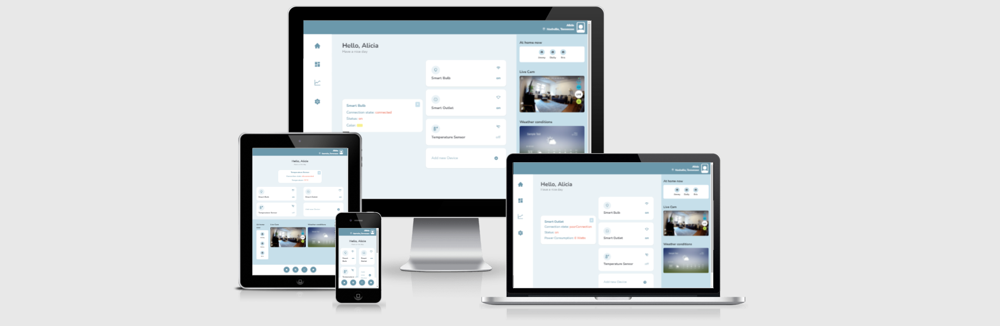

# Smart Home Dashboard solution

See the live version of [Smart Home Dashboard](https://smart-home-dashboard.vercel.app/). The client is deployed to [Vercel](https://vercel.com/), test server lives on [Heroku](https://id.heroku.com).

The project is a sample of a smart home web app interface. It comprises of a mockup UI and an interactive part being a list of three smart devices with information about their state.

**Main features**:

- user can see the updated state of each device: on/off, device type (icon), device name and connection quality (icon)
- after clicking a device card, a new dialog window opens with details of a given device
- user can drag the window around the main part of the screen

&nbsp;

## 💡 Technologies

&nbsp;

## 💭 Conclusions

There are better ways to handle the server logic, for sure. I need to work on that in the future...
Also, I failed to meet the requirement to open the main dialog window in the same position it was closed before. Need to figure it out using `useState` and `useEffect` probably... It was fun with interact.js but still I need to dive deeper into utilising its functions in a more meaningful way.

